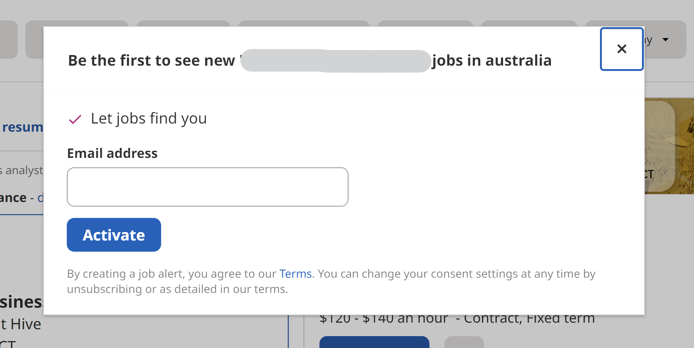
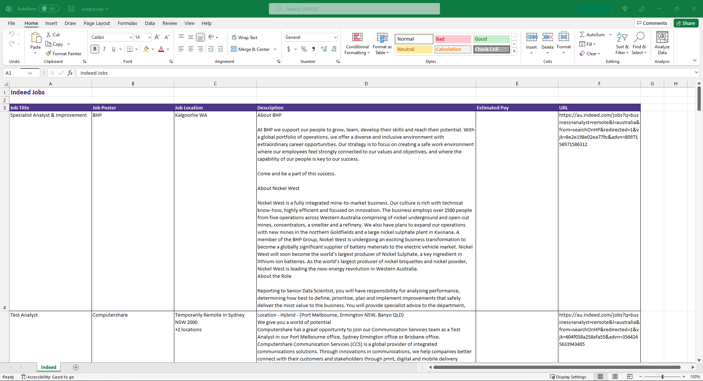

# job-scraper

`job-scraper` searches and extracts job postings from [indeed.com](https://au.indeed.com/) to help with the job application process.

## Description

`job-scraper` is a browser-automation script, written in Python and leveraging the [Selenium](https://selenium-python.readthedocs.io/) framework.

<p align="center">
   &ensp;&ensp;&ensp;&ensp;&ensp;&ensp;
  
</p>

Currently, `job-scraper` automates job scraping in Google Chrome.
<br>
<br>

### Challenges

<details><summary>Click to expand</summary>
<br>Among others, there were two major challenges in this project:

1. Sometimes, Indeed requires dismissal of a **popover element** which obstructed elements of the job posting.

<p align="center">
  
</p>

Noticing the popover's behaviour is appearance within 5 seconds of the first page loading, and the consistent XPATH to the cross, I used try/except to wait until the cross is visible before clicking it. If not exist, proceed with scraping.

NB: [`driver.switch_to.alert.dismiss()`](https://selenium-python.readthedocs.io/api.html?highlight=switch_to#selenium.webdriver.remote.webdriver.WebDriver.switch_to) did not work (cf [StackOverflow question on Indeed.com popover](https://stackoverflow.com/questions/53888159/how-to-close-popover-form-with-python-selenium)) as the popover was not an alert box.

1. Elements on the expanded job posting card raise `NoSuchElementException`s, due to a combination of:
   1. Elements being **hidden** due to window-size (_see orange region in screenshot below_), or

<p align="center">
  
</p>
    This was resolved by scrolling down slightly before searching for the first element:

```python
DRIVER.find_element(By.TAG_NAME, "html").send_keys(Keys.PAGE_DOWN)
```

2. Elements having different XPATHs. To resolve this, I used nested try/except statements to extract the job description element in the `extract_job_description` function.
</details>
<br>

### Future features

<details><summary>Click to expand</summary>
In the future, I will look to:

1. Extract job postings from other job posting sites. For readability, this likely requires introducing Object Oriented Programming (OOP), with a Python class for each site.
2. Extract further attributes from job postings, such as type of work (Permanent, Fixed Term, Contract), and closing date.
</details>
<br>

## How to install

Please install all packages in `requirements.txt`:

```zsh
pip install -r requirements.txt
```

## How to use

1. In `main`, update the `search_url` function with the **key words (_`what=`_), and location (_`where=`_) to search** as strings.

   E.g. to search for "data analyst" positions in "Australia":

```python
search("data analyst", "australia")
```

<p align="center">
  
</p>

2. In `main`, update the 2nd argument of the `scrape_pages` function with the **number of pages** to extract job information with a positive integer. By default, the `scrape_pages` function extracts from the first page only.

   E.g. the following will extract information from the first 5 pages of search results:

```python
scrape_pages("url", 5)
```

3. Run the script to install ChromeDriver through `ChromeDriverManager().install()`.
4. The script will then extract job posting information as a `pandas.DataFrame`, and export as an Excel workbook (`output.xlsx`).

<p align="center">
    
</p>

To edit the look-and-feel of the output Excel workbook, please feel free to modify the `.add_format()` arguments in the variables.

## Licence

MIT
